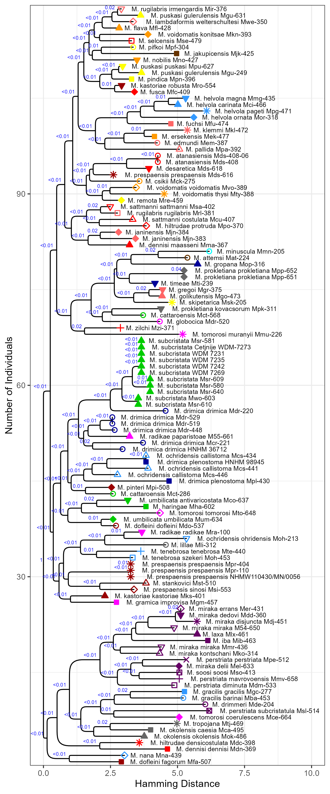
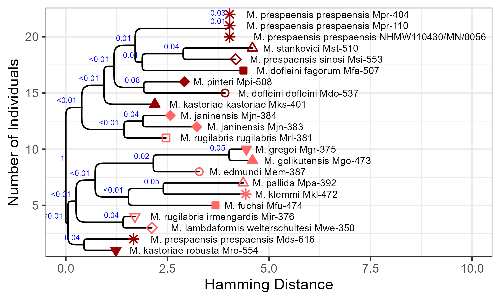
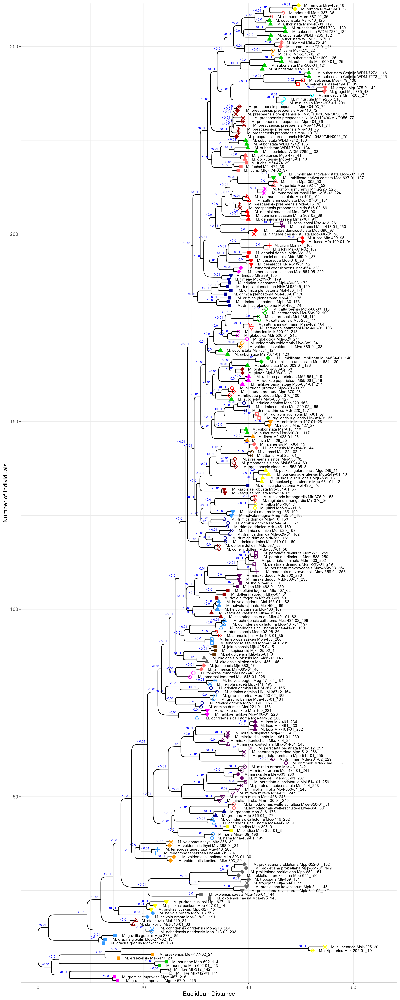

### Montenegrina NJ Tree based on qualitative/quantitative morphological characterization

#### 1) Qualitative Data

Here, I constructed a distance matrix based on hamming distances across all 12 qualitative characters using the _cultevo_ package in _R_. After that, I used the Neighbor-Joining Method as implemented in the package _phangorn_ to reconstruct a tree and applied midpoint rooting using the package _phytools_ prior to plotting the tree with _ggtree_. 
The raw input data can be found [here](data/Montenegrina_rawdata.xlsx) and the R code for the analysis in [here](analyses/analyses.R). I recoded the shape descriptions to PCH parameters as used in R to encode different shapes.

The resulting tree can be found here for the complete dataset: 

...and here for the D1/D2 subset:

#### 2) Quantitative Data
Likewise, I repeated the same analyses for the 24 quantitative datasets using Euclidean distances

The resulting tree can be found here for the complete dataset: 

...and here for the D1/D2 subset:

